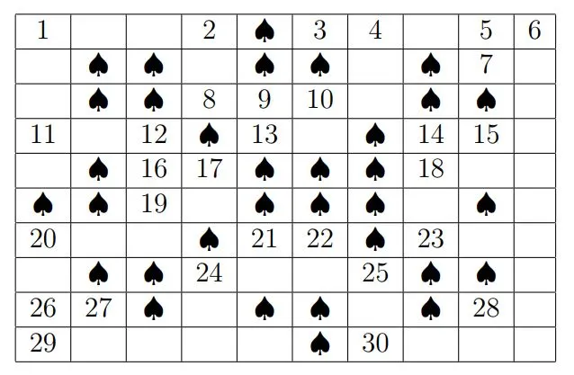



## Barfi Packing

Consider Kaju Barfis in shape of rhombus of side length 1 completely filling a regular hexagonal box of side length \\(n\\). It is easy to see that you can indeed tile it. You can place it with three possible orientations as shown in the figure below.

Prove the following:

> $$ \textit{In any packing, there are an equal number of Kaju Barfis with each orientation.} $$

  
<b>Hint</b>

    Have you seen the logo of <a href="https://artofproblemsolving.com">AoPS</a>?

## Race To 15

Consider the following two-player game:

> Two players, \\(A\\) and \\(B\\), choose numbers from 1 to 9 one after the other. The numbers aren’t available for future use once picked. If at any time the sum of three numbers chosen by one of them adds up to 15 then that player wins.

Who has the winning strategy?

  
<b>Hint</b>

    Form a bijection with <emph>Tic-Tac-Toe</emph>.

## Guess the Sign

Can you guess the sign of the \\(n^{\text{th}}\\) term of the expression?

$$
\prod_{i=1}^\infty (1-a_i) = 1 - a_1 - a_2 + a_1a_2 - a_3 + a_3a_1 + a_3a_2 - a_3a_1a_2 - \dots
$$

## Identify the mathematician #1

Once his new year resolutions were:

- To prove the Riemann hypothesis,
- To make 211 not out in the fourth innings of the last Test Match at the Oval,
- Find an argument for the nonexistence of God which shall convince general public,
- Be the first man at the top of Mount Everest,
- Be proclaimed the first president of USSR, Great Britain & Germany,
- Murder Mussolini.

Who is he?

## Crossword Puzzle #1

Here is the first crossword puzzle. Thanks to [Prof. B. Sury](https://www.isibang.ac.in/~sury/) for sharing this.

**Across:**

1. Nasty but average (4).
2. Euler's constantly talking Greek (5).
3. Cures a Ph.D ? (2).
4. It's complex without an iota of doubt (4).
5. The least upper bound may not be attained but briefly (3).
6. If not General Motors, it is \\(\sqrt{ab}\\) (2).
7. And so on ? (3).
8. \\(a,a+b,a+2b, \dots \\) (2).
9. Cartoon character makes a point (3).
10. A couple of egotists could make a cricket team (2).
11. Follows from the theorem – at least in the beginning (3).
12. Romans counting in Greek? (2).
13. Any trigonometric function under the sun gets this (3).
14. Keep thinking twice to be level (4).
15. Greek novel? (2).
16. 49 is almost ill (2).
17. A function that is little more than a sin (4).

**Down:**

1. The pet of computer enthusiasts (5).
2. This follows neither (3).
3. Or nothing? (3).
4. Could be 7 across (2).
5. Disturbed clear agent has four sides (1,9).
6. For instance (2).
7. This is at least as large as 13 across (2).
8. One of these could be two of these in Hindi (4).
9. A change in diet before publication (4).
10. Following 28 down could give us a product (2).
11. Pig without tail goes around in circles (2).
12. A function drawn without lifting the pen briefly (4).
13. Sum of digits of all its divisors is equal to it. (2).
14. That is to say (2).
15. Shortened member in a group (3).
16. Count them as negative answers? (3).
17. Unitary operators on a Hilbert space simply call for an exclamation (2).
18. See 15 down (2).
