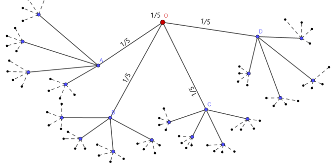



On this page, we will be posting some general problems. You are encouraged to solve them and send your solutions (preferably \\(\LaTeX\\)ed or typed) to <mathclub.isibang@gmail.com>. There is no particular deadline before which you are expected to submit your solutions. A few well-written and nice solutions will be posted up for everyone to see. Happy solving!

## A Puzzle to Puzzle You

[Here](/pdfs/gen_prob/a_puzzle_to_puzzle_you.pdf) is a problem posed by Snehinh Sen, a past student of B. Math.

## An Amusing Integral

This wonderful problem has been posed by Rohan P. Shinde, a past student of B. Math. Try it out!

> Let \\(n,k \in \mathbb N\\) be such that \\(2p \not\equiv 0 (\text{mod } 2k+1)\\) for each \\(p = 1, 2, \dots, n\\). Then is the following true?
> $$ \int_0^\pi \Big[\sin{\left(a + \sin{((2k+1)x)}\right)} \Big]^{2n} {\rm d}x $$
> What can you say if we remove the condition \\(2p \not\equiv 0 (\text{mod } 2k+1)\\) for each \\(p = 1, 2, \dots, n\\)?

## \\(\dots\\) Summing Up

Everyone knows about perfect numbers and how the hunt for an odd perfect number has been frustrating mathematicians since antiquity. Let’s look at a closely related concept.

> A number \\(n \in \mathbb N\\) is called \\(\textit{Quasi-Perfect}\\) if \\(\sigma(n) = 2n+1\\) (sum of divisors function). Prove that a quasi-perfect number cannot be of the form \\(p^aq^b\\) for \\(p, q\\) primes and \\(a, b \geq 1\\).

> 

>  
Bonus:

>    Show that a quasi-perfect number must be an odd square.
> 

But no quasi-perfect numbers have been found so far... want to try and show something more?

(Thanks to Shrivathsa Pandelu for sharing this problem)

## All Roads Lead to "Rome"

> A well known problem asks us to prove that the transformation $$ P: (a,b,c,d) \longmapsto \left(|a-b|, |b-c|, |c-d|, |d-a|\right) $$ on integers, leads any \\((a,b,c,d)\\) to \\((0,0,0,0)\\) after finitely many steps. Try that first. After that, consider the same \\(P\\) on \\(\mathbb R^4\\) now.
>
> Find its fixed points and determine all the \\(4-\\)tuples which do NOT lead to \\((0,0,0,0)\\).

  
<b>Hint:</b>

    Think of it as a sequence with limit and not finite iterations.

(Thanks to [Prof. B. Sury](https://www.isibang.ac.in/~sury/) for sharing this problem.)

## Breaking a Square

> Show that the unit square can be broken into a finite number of pieces each of which is similar to a right-angled triangle with angle degrees 15, 75, and 90. Can this be done for a right triangle with angle degrees 30, 60 and 90.

## \\(\dots\\) Summing Up (again!)

> Identify the pattern and find the sum
> $$ \frac 17 - \frac 19 + \frac 1{15} - \frac 1{17} + \frac 1{23} - \frac 1{25} + \dots $$

(Thanks to [Prof. B. Sury](https://www.isibang.ac.in/~sury/) for sharing this problem)

## A (Very) Long Identity

> Prove the following identity (or still better find more such identities!):
>
> $$
> \begin{align*}
>   & y_1x_1+y_2x_3-1 \\\\
>   & = \\\\
>   & (x_1x_4-x_2x_3)(y_1y_4(x_1y_1+x_2y_3-1)-y_1y_3(x_1y_2+x_2y_4) \\\\
>   & + y_2y_4(x_3y_1+x_4y_3)-y_2y_3(x_3y_2+x_4y_4-1)) \\\\
>   & - (x_1y_1+x_3y_2-1)(x_1y_1+x_2y_3-1+x_3y_2+x_4y_4 \\\\
>   & - 1+(x_1y_1+x_2y_3-1)(x_3y_2+x_4y_4-1) \\\\
>   & - (x_1y_2+x_2y_4)(x_3y_1+x_4y_3))
> \end{align*}
> $$

(Thanks to [Prof. B. Sury](https://www.isibang.ac.in/~sury/) for sharing this problem.)

## Trace Zero Matrices

> Let \\(A\\) be an \\(n \times n\\) real matrix the sum of whose diagonal entries is 0. Show that \\(A = BC-CB\\) for some \\(n \times n\\) matrices \\(B,C\\). Prove the same for \\(n=3\\) and the matrices have integer entries.

(Thanks to [Prof. B. Sury](https://www.isibang.ac.in/~sury/) for sharing this problem.)

## A very strange radical number

> Find the unique positive integer n that satisfies \\(n = \prod\_{(p-1)|n} p\\) where the product is over \\(p-1\\) which divide \\(n\\) and \\(p\\) runs over primes.

(Thanks to [Prof. B. Sury](https://www.isibang.ac.in/~sury/) for sharing this problem.)

## A Sequence in Group

> Let \\(G\\) be a group of order \\(n\\). Suppose \\(G\\) is generated by two elements \\(a, b\\). Show there exists a sequence of elements \\(g_1,g_2, \cdots, g\_{2n}\\) in which each element of G occurs twice and \\(g\_{i+1}=g_i a\\) or \\( g_i b\\) (where \\(g\_{2n+1}\\) is interpreted as \\(g_1\\) etc.).

(Thanks to [Prof. B. Sury](https://www.isibang.ac.in/~sury/) for sharing this problem.)

## He had one job

> Consider a theater with 50 seats which is fully booked for the evening. Each of the 50 people entering the theater (one-by-one) have a seat reservation. However the 1st person is absent-minded and takes any seat at random. Any subsequent person takes his or her seat reserved seat if it is free otherwise picks a free seat at random.
>
> 1. What is the probability that the last person gets his/her reserved seat?
> 2. What is the probability that the 25th person gets his/her reserved seat?

(Thanks to Suvadip Sana (a B. Math passout) for suggesting the problem.)

## Random Walk on \\(4-\\)tree graph

> Consider the \\(4-\\)tree infinite graph as the below image. You have a root, call it \\(O\\), and then 4 edges emanate from \\(O\\). Each edge end acts as an individual root, and notice that each vertex except \\(O\\) (having degree 4) has degree 5. The probability of jumping from \\(O\\) to one of the vertices \\(A, B, C\\) or \\(D\\) is \\(\frac{1}{5}\\) in each case, and the probability of staying at \\(O\\) is \\(\frac{1}{5}\\) as well. Now from each vertex (except \\(O\\)) the probability of jumping to its neighbor is \\(\frac{1}{5}\\).
> 
> Determine weather \\(O\\) is a transient or recurrent state. What can you say about nature of other states? What about an \\(n-\\)tree infinite graph? (Look up all definitions which you don't know on the internet)

## The Hardy-Ramanujan Number

> I remember once going to see him when he was ill at Putney. I had ridden in taxi cab number \\(1729\\) and remarked that the number seemed to me rather a dull one, and that I hoped it was not an unfavorable omen. "No," he replied, "it is a very interesting number; it is the smallest number expressible as the sum of two cubes in two different ways."
>
> --- G. H. Hardy

> $$ \textit{Prove that Ramanujan was right! (Try to be as rigorous as possible)} $$
